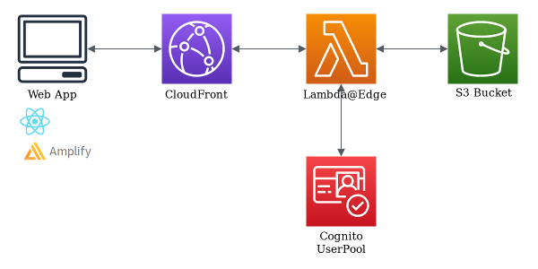

# Cognito@Edge

*Authenticate CloudFront requests with Lambda@Edge based on a Cognito UserPool*



### Requirements
* NodeJS v10+
* AWS account with access to Lambda@Edge and Cognito User Pools

### Installation

```bash
npm install cognito-at-edge
```

### Usage

Create a Lambda function by creating a new file `index.js` and add the following content:

```javascript
const { Authenticator } = require('cognito-at-edge');

const authenticator = new Authenticator({
  region: 'us-east-1', // user pool region
  userPoolId: 'us-east-1_xxxxxxxx',
  userPoolAppId: 'your-app-client-id',
  userPoolDomain: 'your-domain.auth.us-east-1.amazoncognito.com',
  logLevel: 'error',
});

exports.handler = async (request) => authenticator.handle(request);
```

### Cognito UserPool Configuration
1. Create a User Pool domain:
   * In the User Pool console: click on "App integration" -> "Domain name"
   * Configure your domain name
   * Save changes
2. Create an app client in "App clients and analytics" (uncheck "Generate client secret")
3. Configure the app client:
   * Enable the Identity Providers you want to use
   * Set sign in and sign out URLs to your CloudFront distribution URL
   * Under OAuth 2.0:
     * Select "Authorization code grant"
     * Select all desired scopes (openid, email, etc.)

### API Reference

#### Authenticator Class

##### Constructor: `new Authenticator(params)`

Parameters:
* `params` (Object):
  * `region` (string): Cognito UserPool region (e.g., 'us-east-1')
  * `userPoolId` (string): Cognito UserPool ID
  * `userPoolAppId` (string): Cognito UserPool Application ID
  * `userPoolDomain` (string): Cognito UserPool domain
  * `cookieExpirationDays` (number, optional): Days until cookie expiration (default: 365)
  * `logLevel` (string, optional): Logging level (default: 'silent'). Options: 'fatal', 'error', 'warn', 'info', 'debug', 'trace', 'silent'
  * `userPoolSignInEndpoint` (string, optional): Cognito UserPool sign-in endpoint (default: 'authorize'). Options: 'authorize', 'login', 'oauth2/authorize'

##### Method: `handle(request)`

Parameters:
* `request` (Object): Lambda@Edge request object

Returns: Promise that resolves to the authenticated request or redirect response

### License

MIT

### Contributing

Contributions are welcome! Please feel free to submit a Pull Request.
